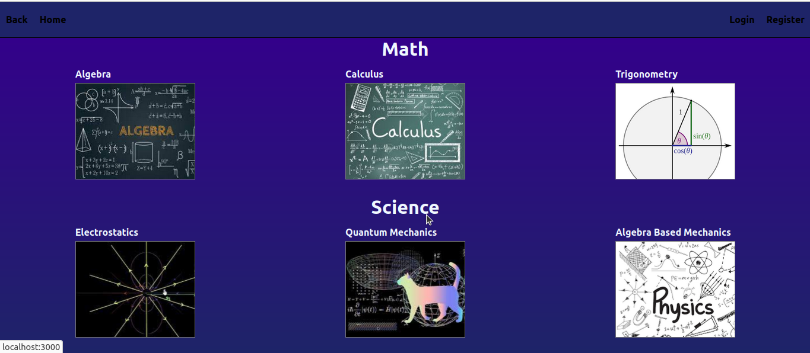
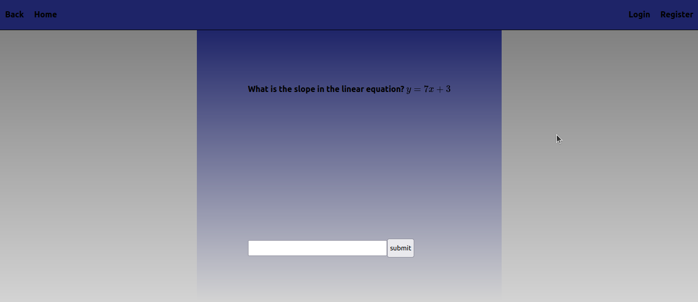

# StemEd

## Description

StemEd is an app for education on STEM subjects. Complete with written lessons and exercises.

## Getting started

1. All data is stored in JSON format and should be stored in either a local instance of a NoSQL database or an online service, such as Mongo Atlas.

2. A .env file should be made in the server folder following the sample.env example

3. Install all node dependencies in the root, server and client folder

4. If a local instance of MongoDb is present, the user can run 
```console
$ seed 
```
&nbsp;&nbsp;&nbsp;&nbsp;&nbsp;&nbsp;&nbsp;&nbsp;from the root folder to populate their local database

4. A user can then simply navigate to the webpage and interact with the lessons. A user should sign in in order to save their completed lessons.




## Tech Stack

StemEd was developed using MongoDB + Mongoose, Node, Express, React, Typescript, and MathJax

## Contributors

Jacob Walsh